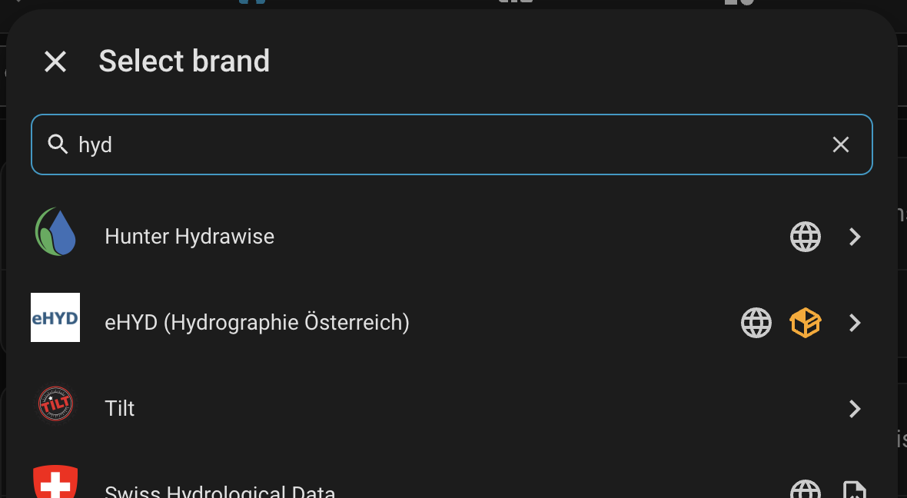
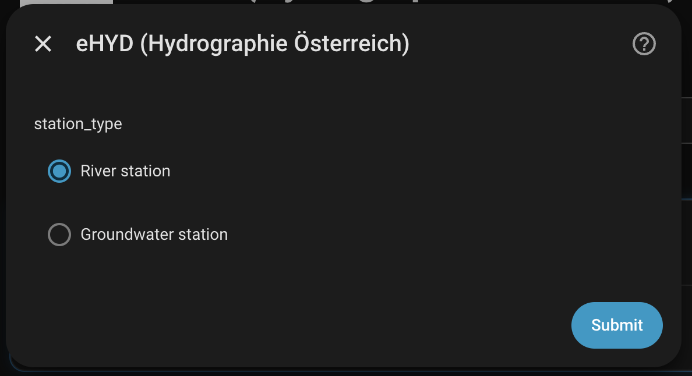
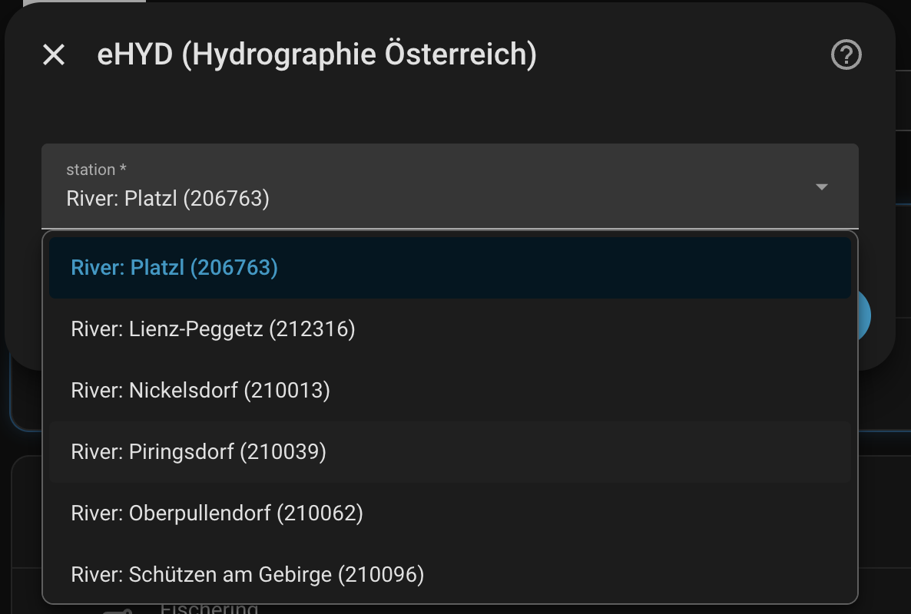
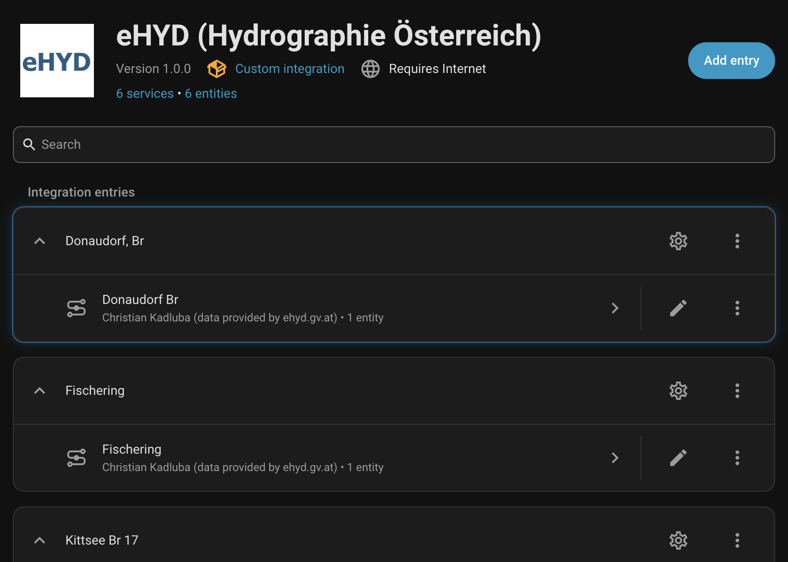
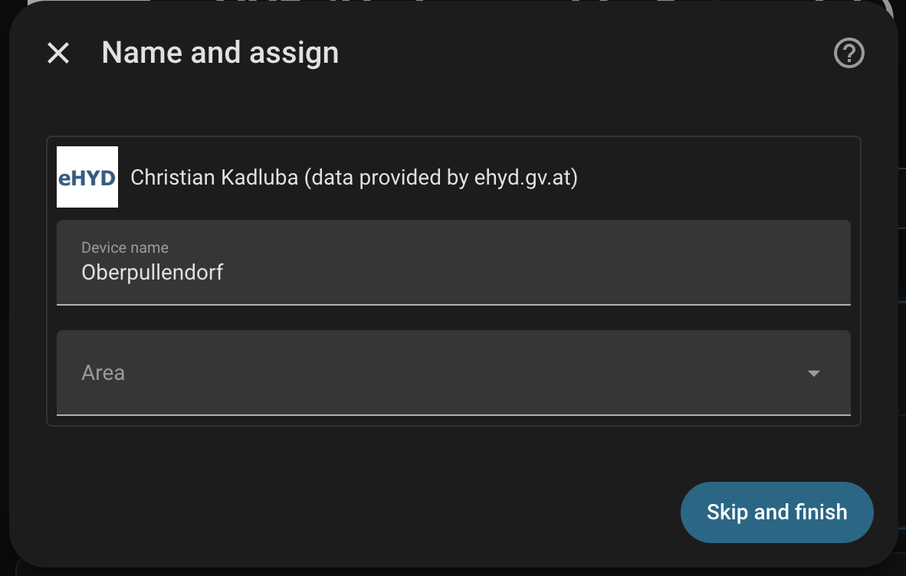
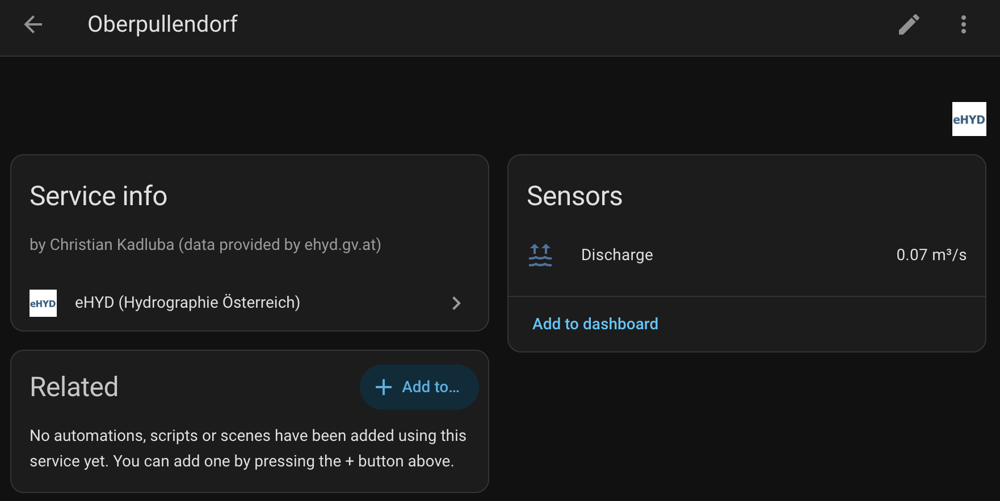

# eHYD – Austrian Hydrography for Home Assistant

This [HACS](https://www.hacs.xyz/) custom integration provides current water-level and discharge data from Austrian monitoring stations through the REST API of [ehyd.gv.at](https://ehyd.gv.at/), the website of Austria's national hydrographic service.

You can select individual river and groundwater stations. Each selected station is added to Home Assistant as its own device with a sensor.

## Disclaimer

This integration is not official software from eHYD, the Austrian federal ministry, Austrian state authorities, or the operators of the monitoring stations. It uses publicly available data from ehyd.gv.at.

The data shown by this integration is **unverified raw data** ("Ungeprüfte Rohdaten") and may contain measurement uncertainties. It is provided without warranty. The author accepts no responsibility for API outages, delays, incomplete measurements, or any consequences resulting from the use of this integration. Do not use these values for safety-critical decisions. For official warnings and flood information, always consult the relevant authorities.

## Features

- Select individual river and groundwater monitoring stations.
- Two-step configuration flow: choose the station type first, then select a station from the matching dropdown list.
- River stations supporting discharge, water level, and elevation measurements, based on the parameter provided by eHYD.
- Groundwater stations providing the groundwater level as elevation above sea level.
- One shared data request for all configured stations of the same data type.
- Hourly updates through a shared Home Assistant data coordinator.
- No account or API key required.

## Installation with HACS

1. Open **HACS** in Home Assistant.
2. Search for **eHYD** or **Hydrographie Österreich**.
3. Install the integration.
4. Restart Home Assistant if HACS asks you to do so.
5. Open **Settings → Devices & services**.
6. Select **Add Integration** and search for **eHYD**.



If the repository is not available in your HACS store, add it as a custom repository with the category **Integration**:

```text
https://github.com/ckadluba/ha-ehyd
```

## Configuration

### Adding the first station

Open **Settings → Devices & services → Add Integration → eHYD**.

The first dialog asks you to choose the station type:



The second dialog provides a dropdown containing stations of the selected type:



After finishing the flow, Home Assistant creates a dedicated device and sensor for the selected station. A station cannot be configured more than once.

### Adding more stations

Open the configuration of an existing eHYD entry and select **Add station**. Choose the station type first, followed by the station itself.

Stations already configured in other eHYD entries are removed from the available choices. You can create multiple eHYD config entries; the integration still coordinates the API requests globally.

### Devices and sensors

Configured stations appear as individual devices:



The device dialog shows the related measurement and sensor attributes:





## Measurements and units

### River stations

The eHYD API provides different parameters for river stations. The integration uses the measurement type supplied by the API:

| API parameter | Measurement | Unit | Home Assistant device class |
| --- | --- | --- | --- |
| `Q` | Discharge | `m³/s` | `volume_flow_rate` |
| `W` | Water level | `cm` | none |
| `W` | Elevation | `m a.s.l.` | none |

Water-level and elevation stations use the `mdi:altimeter` icon. Discharge stations use `mdi:waves-arrow-up`.
The water-level and elevation sensors intentionally have no device class: this
keeps the metric units supplied by eHYD (`cm` and `m a.s.l.`) unchanged and
prevents Home Assistant from converting them to imperial units.

### Groundwater stations

Groundwater stations report the groundwater level as an absolute elevation:

```text
m a.s.l.
```

Home Assistant does not currently provide a dedicated elevation device class. The integration therefore intentionally leaves the device class unset so that the domain-specific unit remains accurate. These sensors also use the `mdi:altimeter` icon.

## Data requests and updates

The eHYD API provides complete station collections rather than one response per station:

- River, water-level, and elevation stations:
  `https://ehyd.gv.at/services/PegelAktuell/json`
- Groundwater stations:
  `https://ehyd.gv.at/services/GrundwasserAktuell/json`

For each update, the coordinator makes at most one request per required endpoint. If only river stations are configured, only the river endpoint is requested. If both river and groundwater stations are configured, one request is made to each endpoint.

The default update interval is one hour. Individual sensors do not make their own API requests; they read their values from the shared response data.

## Requirements

- Home Assistant `2026.4.0` or newer
- HACS, if you want to install the integration through HACS
- Internet access to `ehyd.gv.at`

No account or API key is required.

## Troubleshooting

### The station list is empty

Check whether all stations of the selected type have already been configured in other eHYD config entries. Stations that are already selected are not offered again.

### A sensor shows `unavailable` or `unknown`

Check the Home Assistant logs and verify that `ehyd.gv.at` is reachable. Individual stations may temporarily provide no current value. This can happen with upstream measurement sources and does not necessarily indicate an integration problem.

### API requests fail

The integration needs access to:

```text
https://ehyd.gv.at/services/PegelAktuell/json
https://ehyd.gv.at/services/GrundwasserAktuell/json
```

Check DNS, internet access, firewall rules, and whether the eHYD services are currently available.

## Development

The project includes a Dev Container configuration. For a reproducible development environment, open the repository in VS Code using **Dev Containers: Rebuild and Reopen in Container**.

Dependencies are installed through `scripts/setup`. Home Assistant can be started locally with:

```sh
scripts/develop
```

Run the test suite with:

```sh
pytest -q
```

The required source checks are:

```sh
ruff format custom_components/ehyd --check
ruff check custom_components/ehyd
```

Test code is excluded from the required Ruff checks.

## License

This project is licensed under the [Apache License 2.0](LICENSE).

The data provided by the eHYD API is licensed under the [Creative Commons
Attribution 4.0 International license (CC BY 4.0)](https://geoportal.inspire.gv.at/metadatensuche/inspire/ger/catalog.search#/metadata/6a67faa7-3ad7-4faf-91e9-17a518d10685).
The source of the data is [ehyd.gv.at](https://ehyd.gv.at/). The data is
unverified raw data and may contain measurement uncertainties.

Created by [Christian Kadluba](https://github.com/ckadluba).
